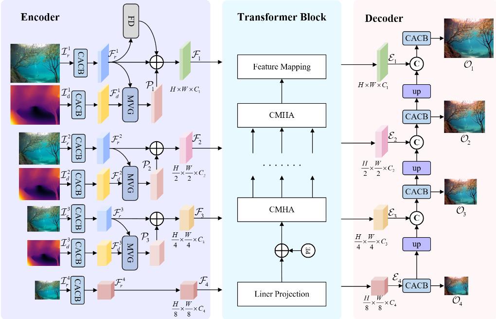

# MVG-FD: Multi-modal Visual Guidance and Feature Decomposition for Underwater Image Restoration

This code repository is the official PyTorch implementation for the underwater image restoration model MVG-FD. 

## Model
Underwater images are frequently affected by light absorption and scattering, which lead to color distortion, reduced contrast, and blurred details, significantly degrading overall image quality. Most underwater image restoration methods are confined to the pixel space of the raw modality, overlooking the important role of other modalities and different frequency-domain features. As a result, the representational capacity of deep learning models is not fully realized, affecting the generation of high-quality images. To address the above issues, we propose Multi-modal Visual Guidance and Feature Decomposition (MVG-FD) method for underwater image restoration. Specifically, we introduce Modality Visual Guidance (MVG) module, which integrates the complementary information provided by \textcolor{blue}{depth} modality features into the raw features to guide the model in restoring the color of underwater images. Meanwhile, we design Feature Decomposition (FD) module, which utilizes Learnable Wavelet Decomposition (LWD) to decompose and extract the high-frequency bands of the raw features to help restore the texture details of the image. Extensive experiments on existing datasets validate the superior performance of MVG-FD. 




### Contents

* Train
* Test
* Results

## Train
If you want to train MVG-FD from scratch, you first need to download the [LSUI](https://github.com/LintaoPeng/U-shape_Transformer_for_Underwater_Image_Enhancement/tree/main) dataset. The LSUI is randomly divided into Train-L (3729 images) and Test-L400 (400 images) for training and testing, respectively. We estimate the depth information for each underwater image using the [MiDaS](https://github.com/isl-org/MiDaS). 

First, modify the training image paths within train.py, and then you can start running it. The initial learning rate is set to 0.0005 for the first 600 epochs and reduced to 0.0002 for the remaining 200 epochs.

Environmental requirements ：
* Python 3.8 
* Pytorch 1.8
* CUDA 10.1 
* OpenCV 4.5.3 
* Jupyter Notebook
  
1. Clone repository：
    ```bash
    git clone https://github.com/zhangao668/MVG-FD.git
    ```
2.  Install requirements：
    ```bash
    pip install -r requirements.txt
    ```

## 使用方法 (二级标题)

```python
# 示例代码
print("Hello, World!")
